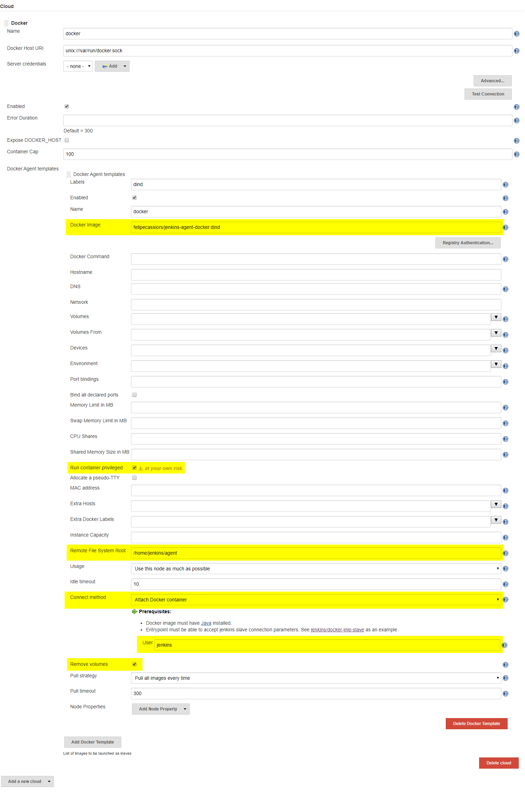

# Jenkins Agent with Docker in Docker

[](https://github.com/felipecassiors/jenkins-agent-dind/actions?query=workflow%3Aci+branch%3Amaster+event%3Apush)
[](https://hub.docker.com/r/felipecassiors/jenkins-agent-dind)

A full fledged Docker in Docker image to act as a Jenkins Agent. Based on [buildpack-deps:bionic](https://github.com/docker-library/buildpack-deps/blob/master/bionic/Dockerfile), it is a mashup of [jenkins/slave](https://github.com/jenkinsci/docker-slave/blob/master/Dockerfile) with [docker:dind](https://github.com/docker-library/docker/blob/master/Dockerfile-dind.template).

- Source code: https://github.com/felipecassiors/jenkins-agent-dind
- Docker image: https://hub.docker.com/r/felipecassiors/jenkins-agent-dind

## Features

- Based on Ubuntu 18.04 Bionic: a more common OS to run your builds.
- From buildpack-deps: a image with many common dependencies installed, run your builds without hassle.
- It contains the latest release of `agent.jar`: even more up-to-date then jenkins/slave itself.
- Fully working Docker in Docker: run your `docker build` commands with no intervention and share of resources between the host.
- Act just as a Jenkins Slave out-of-the-box: run ephemeral build containers by using Docker Plugin for Jenkins.

## Usage

### Command line

Spin this agent in shell, if you want to play with it:

```sh
# Fetches the latest version
docker pull felipecassiors/jenkins-agent-dind
# -ti: allocates a pseudo-TTY in order to run the default command, which is bash
# --rm: removes the container after using it (don't forget to remove the volumes created by it)
# --privilged: needed for running Docker in Docker
docker run -ti --rm --privileged felipecassiors/jenkins-agent-dind
```

### Agent Template in Docker Cloud configuration on Jenkins


